# taskflow-gitops — dépôt GitOps du cours CI/CD M2

Ce dépôt décrit **l'état voulu** de l'application TaskFlow dans Kubernetes.
Argo CD le surveille et aligne le cluster dessus : pour changer la production,
on ne tape pas de commande, on fait une **Pull Request**.

## Installation (à faire chez vous, avant le cours)

Prérequis : Docker Desktop démarré, 8 Go de RAM, 10 Go de disque libre.
Sous Windows : WSL2 (Ubuntu) + intégration WSL de Docker Desktop, et toutes les commandes dans WSL.

```bash
git clone https://github.com/9m7fjfpv9k-cyber/taskflow-gitops.git
cd taskflow-gitops
./scripts/install.sh
```

Le script crée un cluster local `kind`, installe Argo CD et Argo Rollouts,
puis télécharge les images des labs. Comptez 5 à 15 minutes.
Il peut être relancé sans risque.

## Structure

| Chemin | Rôle |
| --- | --- |
| `apps/taskflow/` | Les manifests surveillés par Argo CD |
| `argocd/application.yaml` | Déclare l'application dans Argo CD |
| `exemples/bluegreen/` | Manifests pour le déploiement Blue-Green |
| `exemples/canary/` | Manifests pour le déploiement Canary |
| `scripts/install.sh` | Installation de l'environnement |
| `scripts/argocd-ui.sh` | Ouvre l'interface d'Argo CD |
| `scripts/observe.sh` | Montre quelle version répond, et avec quel code HTTP |

## Images disponibles

`ghcr.io/9m7fjfpv9k-cyber/taskflow` en versions `1.0.0`, `1.1.0`, `2.0.0` et `2.1.0`.

## Équipe

<!-- Noms du binôme -->
- KarimHaddadi20 (solo, binôme absent)

## Labo — déployer par PR, dérive, revenir en arrière

Travail fait seule : pas de binôme à inviter. Le ruleset sur `main` exige une pull request, sans relecture obligatoire, pour pouvoir merger soi-même. Argo CD surveille `https://github.com/KarimHaddadi20/taskflow-gitops.git`, branche `main`, dossier `apps/taskflow`. `selfHeal` et `prune` sont activés. Argo CD relit Git toutes les 60 secondes. Contexte Kubernetes : `kind-cicd` (dans WSL).

Le fork avait été pris sur un dépôt déjà passé en `2.0.0`. La [PR 1](https://github.com/KarimHaddadi20/taskflow-gitops/pull/1) remet l'image à `1.0.0` et pointe Argo CD vers ce fork. C'est le vrai point de départ du labo.

### Où prendre les captures

Une capture sans phrase ne montre pas ce qui a changé. Pour chaque déploiement, deux vues, puis le paragraphe de la section correspondante juste en dessous.

1. **Argo CD** — [https://localhost:8080](https://localhost:8080), utilisateur `admin`. Ouvrir l'application `taskflow`, puis l'horloge **History and rollback**. Chaque ligne est un déploiement : heure, révision Git, état. Capturer la ligne du déploiement dont on parle, pas seulement le badge Synced du moment présent.
2. **GitHub** — onglet **Files changed** de la pull request liée à cette révision. On y voit la ligne qui a vraiment changé (`image:` ou le fichier supprimé).

La dérive ne crée pas de ligne dans History : Git n'a pas changé. Elle se raconte avec les heures mesurées ci-dessous, pas avec une cinquième révision.

Sur cette vue, la carte du haut est le déploiement le plus récent. Chaque carte se lit ainsi : **Deployed At** est l'heure où Argo CD a appliqué le commit, **Revision** est le commit Git, **Authored by** cite la pull request mergée, **Initiated by: automated sync policy** veut dire que personne n'a cliqué sur Sync. **Time to deploy** (6 s, 8 s) est seulement la durée de l'application une fois le sync commencé. Ce n'est pas le délai depuis le merge : ce délai-là est d'environ une minute, le temps qu'Argo CD relise Git.

| History Argo CD | Heure du sync | Révision | Pull request | Ce que le cluster devient |
| --- | --- | --- | --- | --- |
| 0 | 11:13 | `602bb4e` | [PR 1](https://github.com/KarimHaddadi20/taskflow-gitops/pull/1) | image `1.0.0`, 4 replicas, Service présent |
| 1 | 11:19 | `b810163` | [PR 2](https://github.com/KarimHaddadi20/taskflow-gitops/pull/2) | image `2.0.0` |
| 2 | 11:23 | `6ff7d67` | [PR 3](https://github.com/KarimHaddadi20/taskflow-gitops/pull/3) | retour à l'image `1.0.0` |
| 3 | 11:27 | `3610571` | [PR 4](https://github.com/KarimHaddadi20/taskflow-gitops/pull/4) | Service retiré, Deployment conservé |

La capture ci-dessous est la suite de l'historique, plus ancienne. La carte du haut est le passage en `2.0.0` (PR 2). La carte du bas est le premier déploiement en `1.0.0` (PR 1).

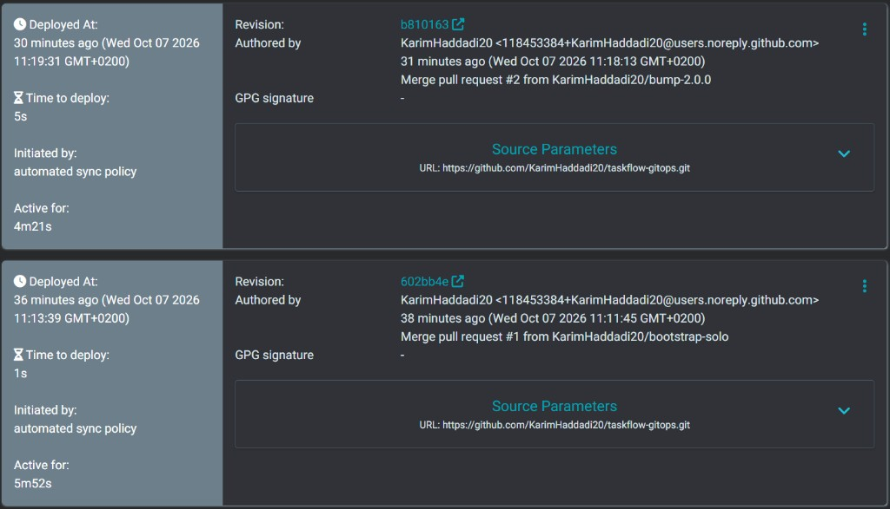

### 1. Premier déploiement — image 1.0.0

Capture : la carte du bas de l'image, révision `602bb4e`, déployée à 11:13:39, et le diff de la PR 1.

`kubectl apply -f argocd/application.yaml` enregistre seulement l'application dans Argo CD. Ensuite Argo CD va lire Git. À 11:14 l'application est Synced et Healthy : 4 pods, image `1.0.0`. `observe.sh` donne 40 réponses `version=1.0.0 http=200`. Personne n'a créé le Deployment à la main.

### 2. Déploiement de la 2.0.0

Capture : la carte du haut de l'image, révision `b810163`, déployée à 11:19:31, et le diff de la PR 2, la ligne `image: ...:2.0.0`. **Time to deploy : 5 s** est la durée du sync, pas l'attente depuis le merge de 11:18:13.

La PR 2 est mergée à 11:18:14. À 11:19:17 le cluster répond encore `1.0.0`. À 11:19:35 Argo CD a pris le nouveau commit et lance le rollout. À 11:20:00 les 4 pods sont Healthy en `2.0.0`. Délai : 81 secondes jusqu'à la nouvelle image, 1 minute 46 jusqu'à Healthy. Ce délai est le temps entre le merge et le prochain passage d'Argo CD sur Git, plus le redémarrage des pods.

### 3. Dérive, puis correction par Argo CD

Pas de capture d'historique pour cette étape : elle n'a pas de révision. Si on la refait devant l'écran, capturer l'application au moment où le Deployment vivant n'a plus 4 replicas ni l'image `2.0.0`, puis la même vue une minute plus tard, redevenue identique à Git.

À 11:20:32, deux commandes écartent le cluster de Git : `kubectl scale` passe à 1 replica, `kubectl set image` passe à `1.1.0`. À 11:20:36 le cluster est bien dans cet état. À 11:20:45 Argo CD a déjà réécrit le Deployment : 4 replicas, image `2.0.0`. À 11:21:14 il est de nouveau Healthy. Git n'a pas reçu de commit. C'est `selfHeal` qui a ramené le cluster sur l'état du dépôt.

La capture ci-dessous est le haut de l'historique Argo CD. La carte du haut est le prune (PR 4). La carte du dessous est le revert (PR 3).

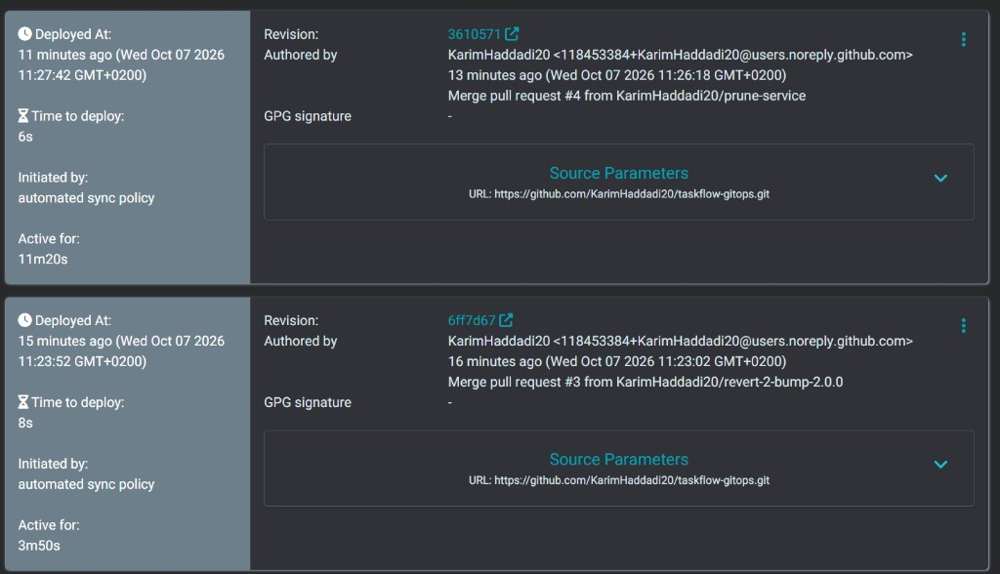

### 4. Revert — retour à l'image 1.0.0

Capture : la carte du bas de l'image, révision `6ff7d67`, déployée à 11:23:52, et la PR 3, dont le titre est `Revert "Passer TaskFlow en image 2.0.0"`.

Le bouton Revert de la PR 2 ouvre une nouvelle pull request. Elle est mergée à 11:23:02. Argo CD synchronise ce commit à 11:23:52. À 11:24:12 les 4 pods sont Healthy en `1.0.0`. `observe.sh` redonne 40 réponses `version=1.0.0 http=200`. Le retour arrière est un nouveau commit sur `main`, pas une modification directe des pods.

### 5. Bonus — suppression du Service (prune)

Capture : la carte du haut de l'historique, révision `3610571`, déployée à 11:27:42, et le diff ci-dessous. Les 13 lignes de `apps/taskflow/service.yaml` sont supprimées. Ce fichier n'est plus dans Git, donc Argo CD retire le Service du cluster.

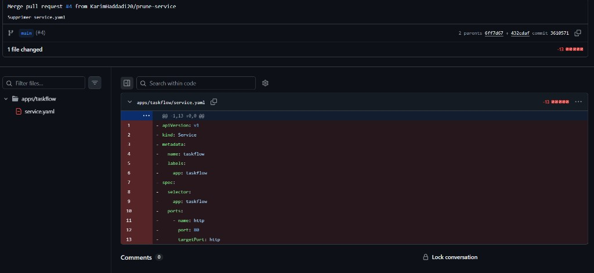

La PR 4 retire `apps/taskflow/service.yaml`. Merge à 11:26:18. À 11:27:41 le Service n'est plus dans le namespace. À 11:27:47 l'application est de nouveau Synced et Healthy. Le Deployment `1.0.0` est toujours là, en 4 pods. Argo CD a effacé la ressource qui n'existe plus dans Git parce que `prune: true`.

### Réponses

**Push ou pull.** C'est du pull. Argo CD interroge Git environ chaque minute et aligne le cluster. Le merge de la PR 2 n'a rien poussé dans Kubernetes : l'image n'a changé qu'au sync de 11:19, plus d'une minute après le merge.

**Qui a corrigé quoi.** La PR 2 corrige Git (l'état voulu passe à `2.0.0`) et Argo CD aligne le cluster. La dérive est corrigée par Argo CD seul, via `selfHeal` : Git reste en `2.0.0` et 4 replicas, le cluster y revient. Le revert est corrigé dans Git par la PR 3, puis Argo CD retire la `2.0.0`. Le Service est retiré par Argo CD via `prune`, parce que le fichier n'est plus dans le dépôt.

**Pourquoi un git revert.** Le bouton Revert ajoute un commit qui annule le précédent. L'historique reste lisible : la PR 2 a déployé `2.0.0`, la PR 3 l'a annulée. Un `reset` réécrirait `main`, ce que le ruleset interdit, alors qu'Argo CD a déjà synchronisé le commit `2.0.0`.

## Labo de l'après-midi — Blue-Green, puis Canary

Les captures se prennent au même endroit que le matin : Argo CD, application `taskflow`, horloge **History and rollback**. Chaque carte est un déploiement. On colle la capture dans ce README, puis on écrit ce que la carte a changé. **Time to deploy** reste la durée du sync, pas le délai depuis le merge.

### Blue-green

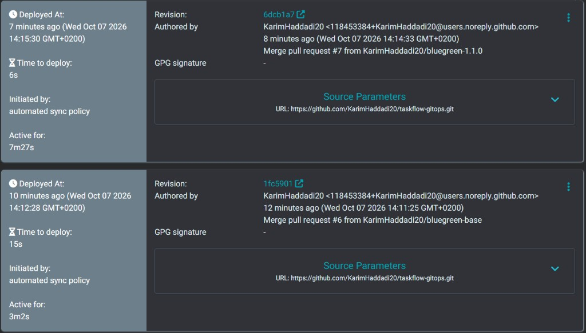

La carte du bas, révision `1fc5901`, est déployée à 14:12:28. C'est la [PR 6](https://github.com/KarimHaddadi20/taskflow-gitops/pull/6), mergée à 14:11:26. Le Deployment est remplacé par un Rollout blue-green : service actif `taskflow`, service de preview `taskflow-preview`, promotion manuelle. L'image reste `1.0.0`. À 14:13:13 le Rollout est Healthy, 4 pods. **Time to deploy : 15 s.**

La carte du haut, révision `6dcb1a7`, est déployée à 14:15:30. C'est la [PR 7](https://github.com/KarimHaddadi20/taskflow-gitops/pull/7), mergée à 14:14:33. Seule la ligne `image` passe à `1.1.0`. **Time to deploy : 6 s.** Argo CD a attendu son prochain passage sur Git, environ une minute, avant d'appliquer.

La capture suivante est l'arbre de l'application pendant la pause, pas l'historique. L'icône pause est sur le Rollout. Deux ReplicaSets tournent en même temps.

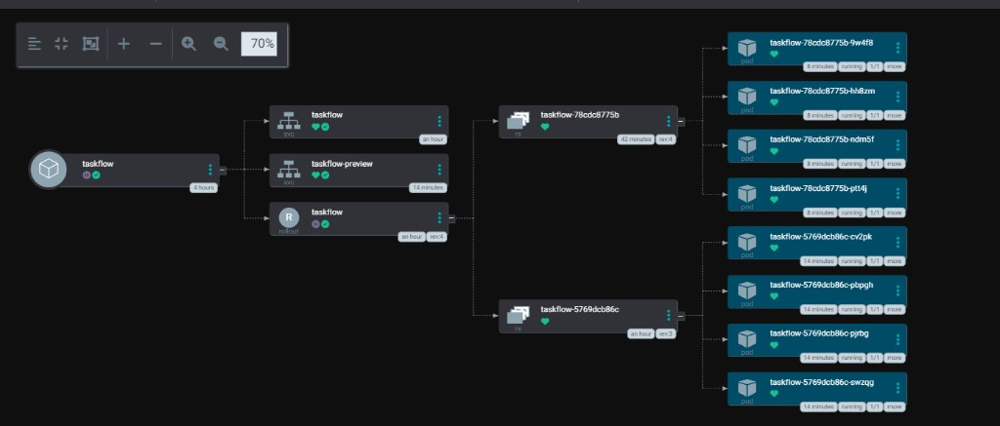

- `taskflow-5769dcb86c` : 4 pods en `1.0.0`. C'est la version active, branchée sur le Service `taskflow`.
- `taskflow-78cdc8775b` : 4 pods en `1.1.0`. C'est la version de preview, branchée sur le Service `taskflow-preview`.

À 14:15:54 le Rollout était en `BlueGreenPause`. `observe.sh` donne 40 réponses `version=1.0.0 http=200` sur `taskflow`, et 40 réponses `version=1.1.0 http=200` sur `taskflow-preview`. La production n'a pas bougé. La nouvelle version ne reçoit que le Service de preview. Le coût est immédiat : 8 pods au lieu de 4, le temps de vérifier.

Promotion à 14:17:02. À 14:17:50 il ne reste que 4 pods, tous en `1.1.0`. Les deux Services répondent alors `version=1.1.0 http=200`. L'ancienne version a été arrêtée après `scaleDownDelaySeconds: 30`. Le coût du blue-green est ce doublement : 8 pods le temps de la vérification, et aucun utilisateur de la production ne voit la `1.1.0` avant la promotion.

### Canary — départ en 1.1.0

La carte du haut est le passage au canary. Révision `b424b6e`, déployée à 15:09:38. C'est la [PR 13](https://github.com/KarimHaddadi20/taskflow-gitops/pull/13), mergée à 15:08:03. La stratégie blue-green est remplacée par un canary, l'image reste `1.1.0`, et le Service `taskflow-preview` est supprimé. **Time to deploy : 20 s.** **Initiated by: automated sync policy** : personne n'a cliqué sur Sync. La carte du dessous, `5dfee80`, est encore le blue-green de la PR 11.

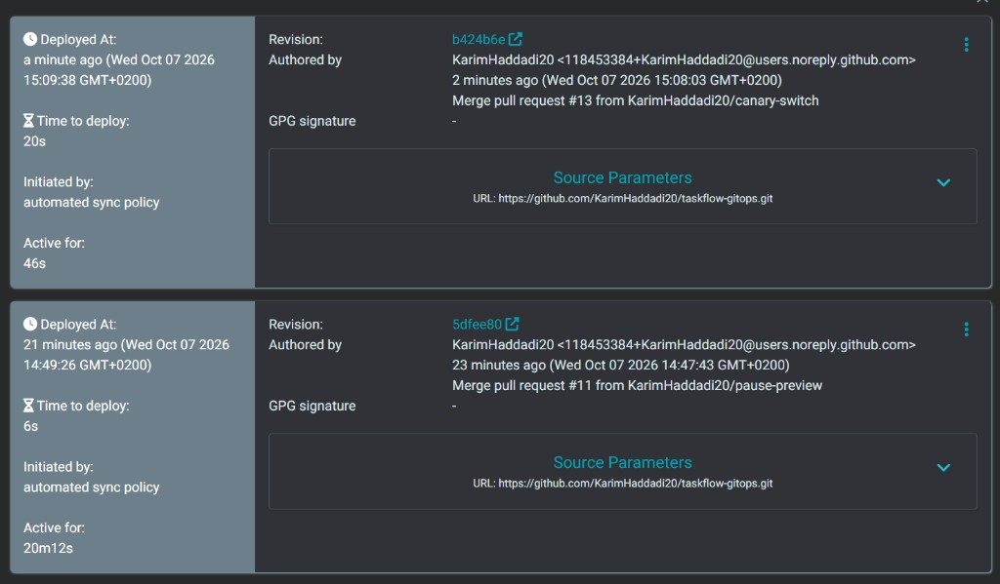

L'arbre ne montre plus `taskflow-preview`. Un seul Service, `taskflow`. Les 4 pods qui tournent sont ceux de `taskflow-78cdc8775b`, en `1.1.0`. Le ReplicaSet `taskflow-5769dcb86c` est l'ancienne révision `1.0.0` : il reste affiché, sans pod. Il ne reçoit plus de trafic.

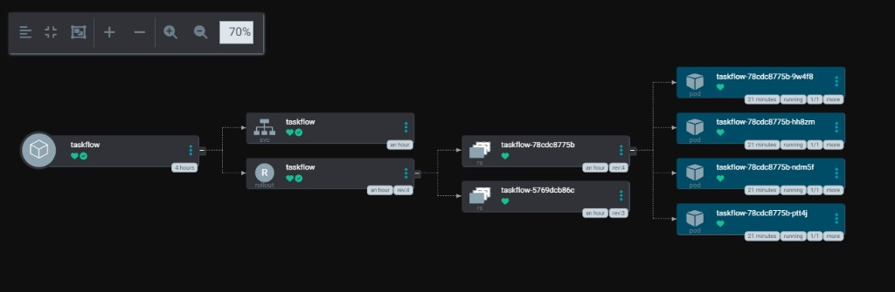

Aucun palier canary n'a encore commencé : l'image n'a pas changé. Le prochain déploiement, l'image `2.0.0`, enverra d'abord 25 % du trafic, soit 1 pod sur 4.

### Canary — 25 % en 2.0.0

L'image passe à `2.0.0` avec la [PR 15](https://github.com/KarimHaddadi20/taskflow-gitops/pull/15), mergée à 15:19:40. Le Rollout s'arrête tout seul sur la première pause, `CanaryPauseStep`, à 15:21:42. Étape 1/6, poids demandé 25, poids réel 25. Sans maillage de service, ce poids est une part des pods : 1 pod sur 4.

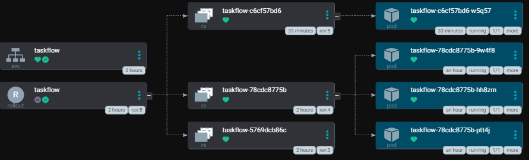

- `taskflow-c6cf57bd6` : 1 pod, `taskflow-c6cf57bd6-w5q57`, en `2.0.0`. C'est le canary, créé avec ce déploiement.
- `taskflow-78cdc8775b` : 3 pods, en `1.1.0`. C'est la version stable, celle qui recevait déjà tout le trafic.
- `taskflow-5769dcb86c` : aucun pod. C'est l'ancienne `1.0.0`, déjà réduite à zéro.

`observe.sh taskflow 40` pendant cette pause : 33 réponses `version=1.1.0 http=200` et 7 réponses `version=2.0.0 http=200`. Les deux versions répondent correctement. Les 7 requêtes sur 40 tombent sur l'unique pod `2.0.0` : autour d'un quart, pas une coupure nette. Une partie des utilisateurs de la production voit déjà la `2.0.0`, alors que le blue-green la cachait derrière `taskflow-preview` jusqu'à la promotion.

### Canary — 50 % en 2.0.0

La promotion quitte la pause manuelle des 25 %. Le Rollout passe à l'étape 3/6 à 15:57:57 : poids demandé 50, poids réel 50, message `CanaryPauseStep`. Cette pause du manifeste dure 60 s. Elle a été maintenue le temps de la capture, pour ne pas enchaîner sur 75 % pendant la photo.

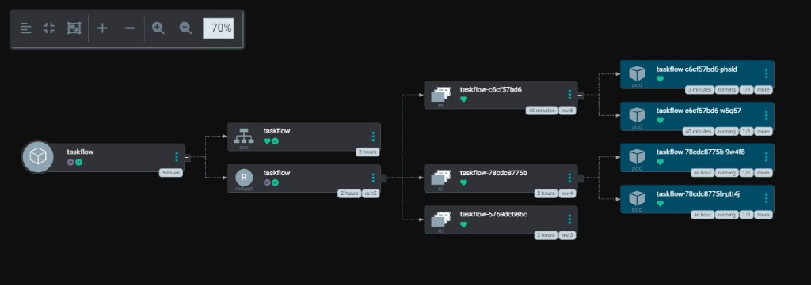

- `taskflow-c6cf57bd6` : 2 pods en `2.0.0`. `w5q57` était déjà là à 25 %. `phsld` est le pod ajouté pour atteindre la moitié.
- `taskflow-78cdc8775b` : 2 pods en `1.1.0`, `9w4f8` et `ptt4j`. Le troisième pod `1.1.0` a été arrêté.
- `taskflow-5769dcb86c` : toujours aucun pod.

`observe.sh taskflow 40` : 21 réponses `version=1.1.0 http=200` et 19 réponses `version=2.0.0 http=200`. Le trafic suit bien la moitié des pods. La `2.0.0` répond correctement, et elle est déjà vue par environ un utilisateur sur deux.

### Canary — 75 % en 2.0.0

La promotion quitte la pause des 50 %. Le Rollout passe à l'étape 5/6 à 16:04:29 : poids demandé 75, poids réel 75, message `CanaryPauseStep`. Cette pause du manifeste dure 30 s. Elle a été maintenue le temps de la capture.

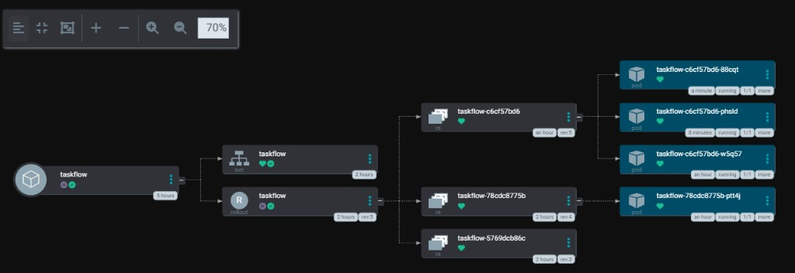

- `taskflow-c6cf57bd6` : 3 pods en `2.0.0`. `w5q57` et `phsld` étaient déjà là. `88cqt` est le pod ajouté pour le palier 75 %.
- `taskflow-78cdc8775b` : 1 seul pod en `1.1.0`, `ptt4j`. `9w4f8` a été arrêté.
- `taskflow-5769dcb86c` : toujours aucun pod.

`observe.sh taskflow 40` : 12 réponses `version=1.1.0 http=200` et 28 réponses `version=2.0.0 http=200`. Environ trois requêtes sur quatre tombent sur la `2.0.0`. Elle répond correctement. Il reste un quart du trafic sur l'ancien pod.

### Canary — 100 % en 2.0.0

La dernière promotion quitte la pause des 75 %. Il n'y a plus d'étape après. À 16:08:41 le Rollout est Healthy, étape 6/6, poids 100. La `2.0.0` n'est plus un canary : c'est la version stable.

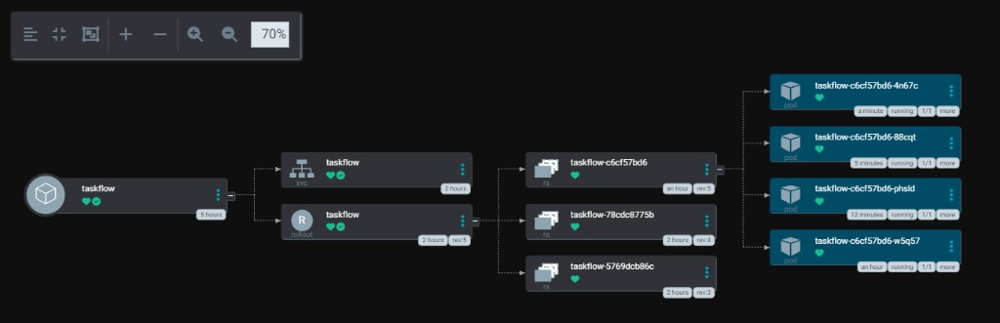

- `taskflow-c6cf57bd6` : 4 pods en `2.0.0`. `w5q57`, `phsld` et `88cqt` étaient déjà là. `4n67c` est le pod ajouté pour finir le déploiement.
- `taskflow-78cdc8775b` : plus aucun pod. C'était la `1.1.0`.
- `taskflow-5769dcb86c` : toujours vide. C'était la `1.0.0`.

`observe.sh taskflow 40` : 40 réponses `version=2.0.0 http=200`. Plus aucune requête ne tombe sur `1.1.0`. Le canary de la `2.0.0` est terminé. Les quatre paliers ont gardé 4 pods au total : le coût en ressources n'a pas doublé, contrairement au blue-green, mais une part des utilisateurs voyait déjà la nouvelle version avant la fin.
